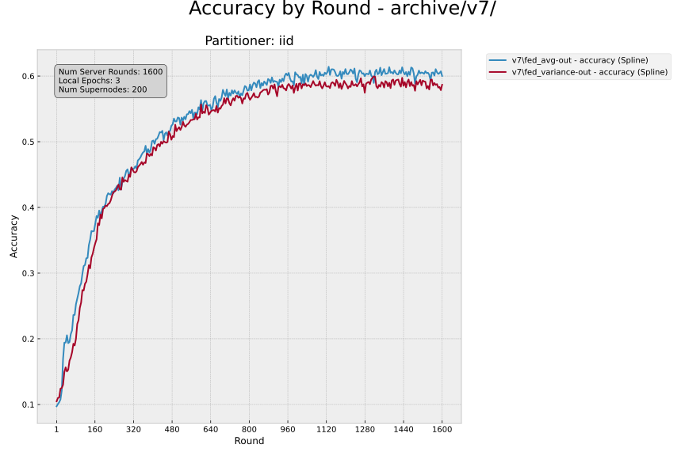

# asfl


## create and activate venv
```bash
python -m venv venv

source venv/bin/activate # linux
# OR 
source venv/Scripts/activate # windows
```

## Install dependencies

```bash
pip install . --no-cache-dir
```

## Setup the toml configuration

```toml
[tool.flwr.app.config]
num-server-rounds = 100 # number of server rounds
local-epochs = 3 # number of local epochs for each client
strat-mode = "fed_avg" # select strategy
inplace = true
file-writing = true

[tool.flwr.federations.local-simulation]
options.num-supernodes = 2 # number of vehicles
```


## Run (Simulation Engine)

In the `asfl` directory, use `flwr run` to run a local simulation:

```bash
flwr run
```

Advanced simulation

```bash
flower-simulation --app . --num-supernodes 50 --run-config 'num-server-rounds=800 strat-mode="fed_variance" local-epochs=1'

flower-simulation --app . --num-supernodes 200 --run-config 'num-server-rounds=1600 strat-mode="fed_variance" local-epochs=3'
flower-simulation --app . --num-supernodes 200 --run-config 'num-server-rounds=1600 strat-mode="fed_avg" local-epochs=3'

```

## Current strategies

* `fed_acc` weighted avg on the accuracy self reported by the client
* `fed_loss` weighted avg on the inverse loss self reported by the client
* `fed_equal` weighted avg, weights all clients equally
* `fed_variance` weighted avg on the label variance
* `fed_freq` weighted avg on the inverse number of training rounds included
* `fed_fuzz` fuzz logic adaptive aggregation, loss and accuracy
* `federal_avg` fed avg baseline

## Processing data outputs

Move the logged `.txt` files into a new archive - example `mv fed_example archive/v1234/`

In your archive, create an `i.yaml` file with the correct parameters.

The `i.yaml` file should contain these fields at minimum. 

```yaml
server_configuration:
  num_server_rounds: 800
  local_epochs: 1
  num_supernodes: 50
  partition: "dirichlet"
```

Change the outputs to CSV
- run `scripts/summary.py` on a file to get the CSV out
    + example: `python scripts/summary.py scripts/fed_acc.txt`
    + example: `python scripts/summary.py archive/v5/fed_avg.txt`
- use `scripts/many.sh` to run summary on a directory
    + example: `./scripts/many.sh archive/v5/`

Plotting
- `plot.py` plots with dots at each point
    + `python archive/plot.py archive/v5/`
- `curve.py` plots the spline line graph
    + `python archive/curve.py archive/v5/`
- `diff.py` plots the difference in accuracy between a file name in the directory, and the other files in a directory
    + `python archive/diff.py fed_avg-out.csv archive/v5/`
## Fun Simulation Results


