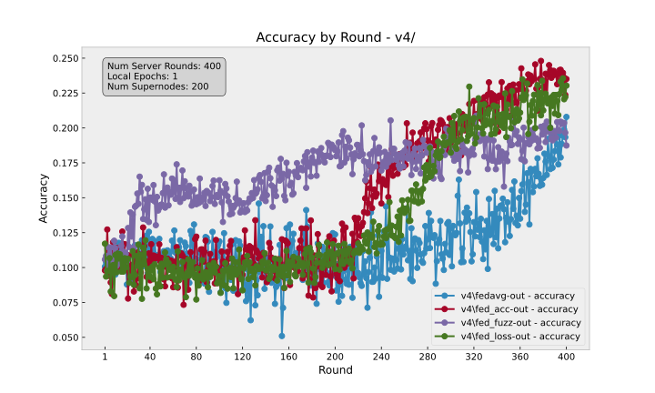
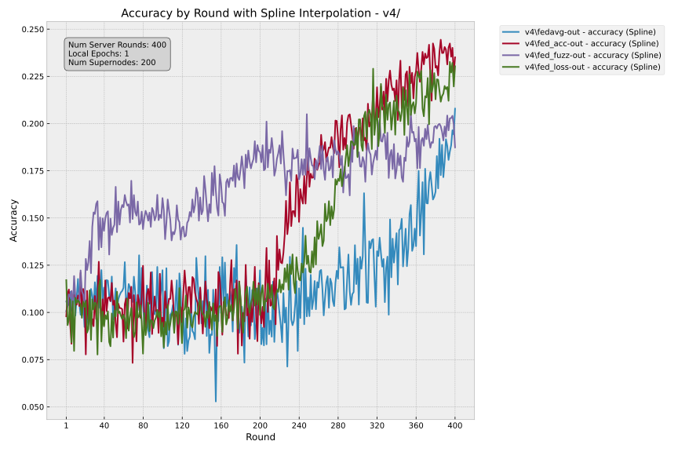

# asfl


## create and activate venv

```bash
source venv/Scripts/activate
```

## Install dependencies

```bash
pip install .
```

## Setup the toml configuration

```toml
[tool.flwr.app.config]
num-server-rounds = 100 # number of server rounds
local-epochs = 3 # number of local epochs for each client
strat-mode = "fedcustom" # fedcustom or fedavg
inplace = true
file-writing = true
```


## Run (Simulation Engine)

In the `asfl` directory, use `flwr run` to run a local simulation:

```bash
flwr run
```

Advanced simulation

```bash
flower-simulation --app . --num-supernodes 200 --run-config 'num-server-rounds=400 strat-mode="fed_fuzz"'
```

## Fun Simulation Results




